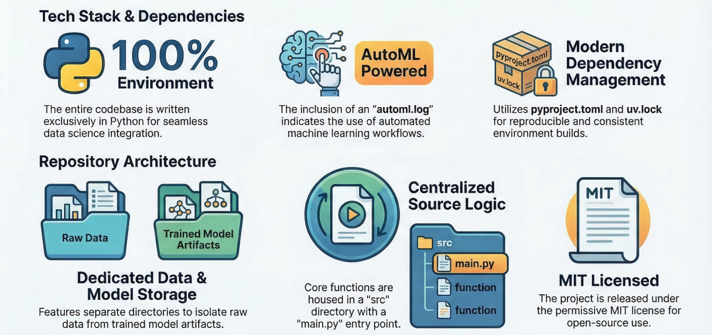
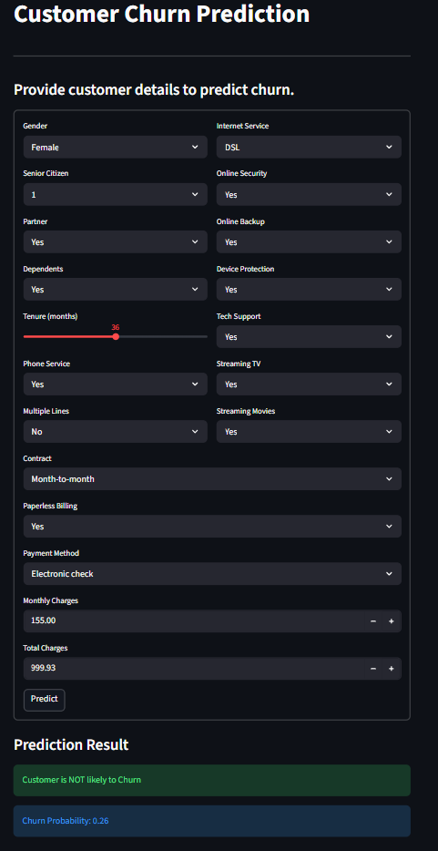

## **Customer Churn Prediction Model**

### **Author: Chandan Chaudhari**

---

## **Problem Definition:**

Customer churn refers to the phenomenon where customers stop doing business with a company or discontinue a service. In highly competitive industries such as telecommunications, retaining existing customers is more cost-effective than acquiring new ones.

This project aims to develop a machine learning model that can analyze customer data and predict whether a customer is likely to churn. By identifying potential churners in advance, organizations can take proactive steps to improve customer retention and reduce revenue loss.

---

## **Problem Statement:**

The objective of this project is to build an end-to-end machine learning pipeline that predicts customer churn based on historical customer data. The model should be able to:

* Accurately classify customers into churn and non-churn categories

* Handle imbalanced data using appropriate techniques

* Process both numerical and categorical features efficiently

* Provide a scalable and reusable pipeline for real-world deployment

The solution leverages data preprocessing, feature engineering, and AutoML techniques to select the best-performing model while ensuring reproducibility through experiment tracking and model versioning.

---

## **Project Workflow:**

1. Data Ingestion

2. Data Preprocessing

   * Handling missing values

   * Encoding categorical variables

   * Feature scaling

   * SMOTE for class imbalance

   * Dimensionality reduction (SVD)

3. Model Building using AutoML

4. Model Evaluation

5. Model Saving (Pickle)

---

## **Architecture Diagram**

---

## **Deployment UI**

